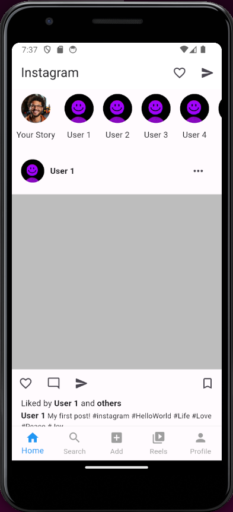
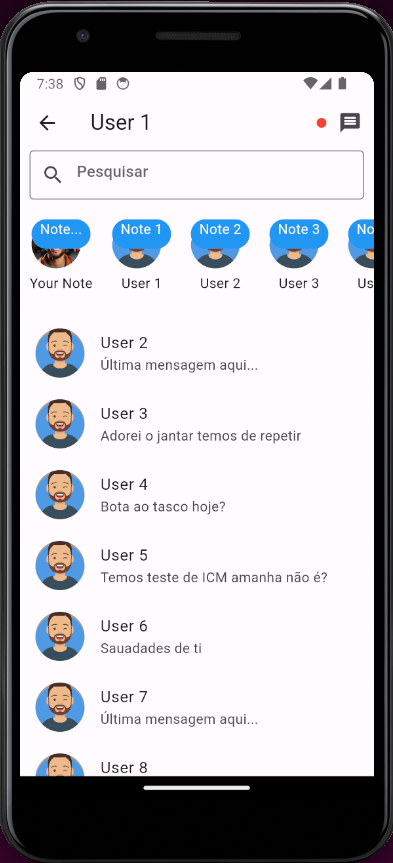
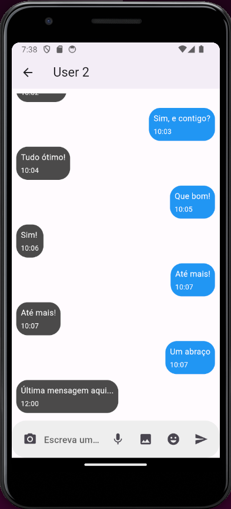
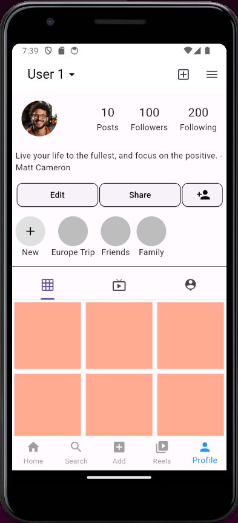
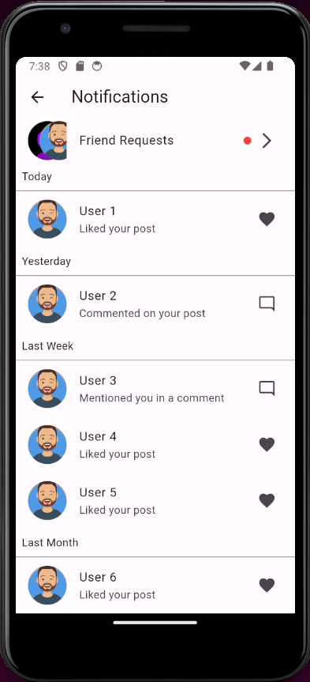
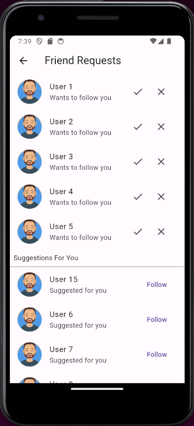
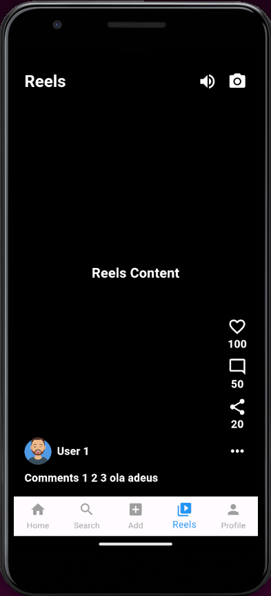
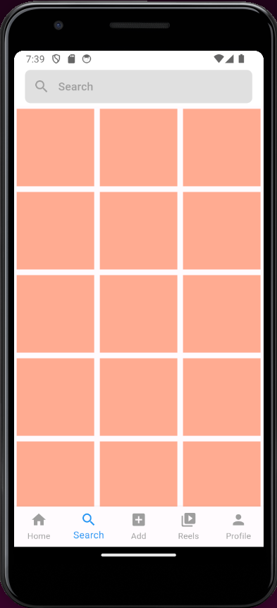
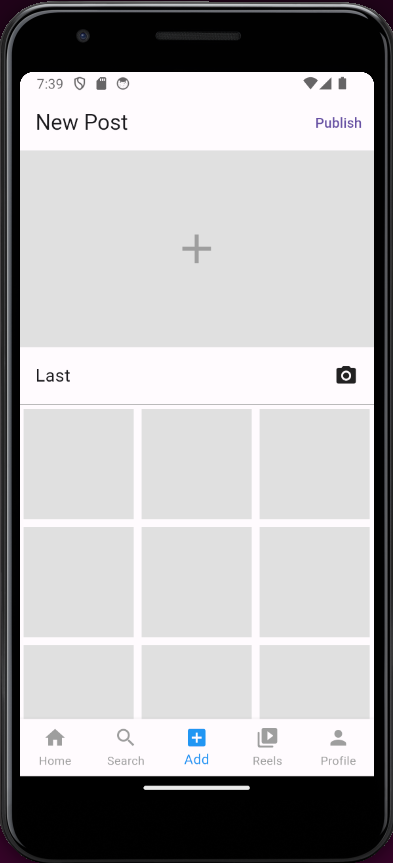
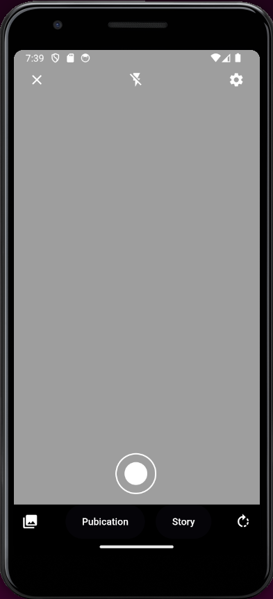

# Instagram UI Clone

This is a project for the purpose of learning Flutter. The project is a clone of the Instagram app UI. I implemented the principal features of the Instagram app, such as the feed, stories, and the profile page, chat, and notifications.

## Technologies

- [Flutter](https://flutter.dev/)

## How to run

1. Clone this repository
2. Run `flutter pub get`
3. Run `flutter run`

You can also run the app on a simulator or a real device.

## Screenshots

### Feed

### Chat

### Profile

### Notifications

### Friend Requests

### Reels

### Search

### Add

### Camera

## Note

Its important to mention that this project is not a real Instagram app, it's just a clone of the Instagram app UI. The project was made for the purpose of learning Flutter to the classe Introduction Mobile Development. The project is principle to learn the basic concepts of Flutter, such as the use of widgets, the use of the Material Design, and the use of the Cupertino Design. The project is not a real app, and it's not connected to the Instagram API, and can be much better than it is now.